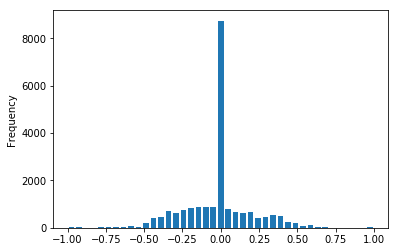
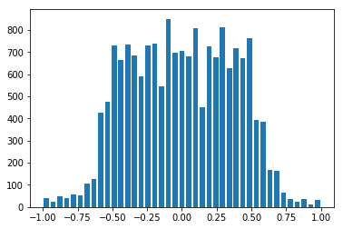

# **Behavioral Cloning Project**

The goals / steps of this project are the following:

* Use the simulator to collect data of good driving behavior
* Build, a convolution neural network in Keras that predicts steering angles from images
* Train and validate the model with a training and validation set
* Test that the model successfully drives around track one without leaving the road
* Summarize the results with a written report

[//]: # (Image References)

[image1]: ./output/model_architecture_summary.png "Model Visualization"
[image2]: ./output/center.png "Center driving"
[image3]: ./output/recoverygif.png "Recovery training"
[image4]: ./output/flipped.png "Flipped Image"
[image5]: ./output/brightness.png "Brightness adjustment"
[image6]: ./output/shadow.png "Shadow effect"
[image7]: ./output/gamma.png "Gamma correction"
[image8]: ./output/trans.png "Translation effect"

---
## Files Submitted & Code Quality

### 1. Submission includes all required files

My project includes the following files:

* *README.md* summarizing the results
* *README.html* HTML version of the README.md
* *dataexploration.ipynb* data exploration steps, results and decisions
* *dataexploration.html* HTML version of the dataexploration python notebook
* *model.py* containing the overall script to create and train the model
* *drive.py* for driving the car in autonomous mode
* *model-best.h5* containing a trained convolution neural network 
* *utils.py* containing utility functions
* *generator.py* containing data generator class implementation
* *dataloader.py* containing data loader class implementation
* *modelarchitecture.py* containing keras based cnn implementation
* *settings.py* contains a class implementation for command line settings
* *video.py* contains the code for generating video output from the images during autonomous self driving car test runs in the udacity simulator
* *output* a folder containing supplimental images and files used for our reports

#### Autonomous driving videos

* [**Track 1**](https://youtu.be/99Bz0FFWI3Y)
* [**Track 2**](https://youtu.be/MPQ9qA0E1D0)

### 2. Submission includes functional code

Using the Udacity provided simulator and my drive.py file, the car can be driven autonomously around the track by executing 
```sh
python drive.py model-best.h5
```

### 3. Submission code is usable and readable

The *modelarchitecture.py* file contains the code for training and saving the convolution neural network. The file shows the pipeline I used for training and validating the model, and it contains comments to explain how the code works.

## Model Architecture and Training Strategy

### 1. An appropriate model architecture has been employed

My model is based on **NVIDIA's CNN** (*modelarchitecture.py lines 37-59*) consists of 

* three 5x5 convolution layers with 2x2 strides
* two 3x3 convolution layers with 1x1 strides
* four fully connected layers ending with a single output.

The input data (image) is normalized in the model using a Keras lambda layer (*modelarchitecture.py line 32*). The input image of size **160x320** pixels, is cropped to **66x200** pixels size to leave out the less useful data (sky, trees and hood of the car).

### 2. Attempts to reduce overfitting in the model

The model contains two dropout layers in order to reduce overfitting (*modelarchitecture.py lines 43 and 50*).

The model was trained and validated on different data sets for each of the EPOCH to ensure that the model was not overfitting (*generator.py*). The model was tested by running it through the simulator and ensuring that the vehicle could stay on the track.

### 3. Model parameter tuning

The model used an adam optimizer, so the learning rate was not tuned manually (*modelarchitecture.py line 62*).

### 4. Appropriate training data

Training data was chosen to keep the vehicle driving on the road. Data collection strategies include:

* Three laps of driving in center of the lane
* Two laps of recovery from left and right edges of the lane
* One lap of recovery from left and right edges from the second track

For details about how the training data split/used for training the model, see the next section. 

## Model Architecture and Training Strategy

### 1. Solution Design Approach

The overall strategy for deriving a model architecture was to ...

My first step was to start with **NVIDIA CNN** model. I thought **NVIDIA CNN** model might be appropriate because it was one of the proven model to have worked with a small amount of training data. One of the alternate architectures that I have considered was **LeNet CNN** from prior projects.

In order to gauge how well the model was working, I split images and steering angle data into a training and validation set. I found that my first model had a low mean squared error on the training set but a high mean squared error on the validation set. This implied that the model was overfitting. 

To combat the overfitting, I modified the model to include dropout layers and different training and validation sets for each of the EPOCH.

The final step was to run the simulator to see how well the car was driving around track one with two laps center driving data. There were a few spots where the vehicle fell off the track. To fix the issues and to make our model robust,

* one more lap (3rd lap) of center driving data collected 
* two laps of recovery from left and right edges are collected 
* one lap of track 2 data is collected

At the end of the process, the vehicle is able to drive autonomously on both tracks without leaving the road.

### 2. Final Model Architecture

The final model architecture (*modelarchitecture.py*) consisted of a convolution neural network with the following layers and layer sizes.

![][image1]

### 3. Creation of the Training Set & Training Process

#### 1. Center driving

To capture good driving behavior, two laps of driving on the center of the lane on our first track was recorded. Here is an example image for driving on the center of the lane:

![][image2]

#### 2. Recovery training

I then recorded the vehicle recovering from the left side and right sides of the road back to center so that the vehicle would learn to get back to the center of the lane. These images show what a recovery looks like: starting image, recovery in-progress image and end of recovery image.

![][image3]

#### 3. Data augmentation with random effects

**Image Flipping**

To augment the data sat, I also flipped images and angles so that this would reduce/balance left-shifting issues. For example, here is an image that has then been flipped:

![][image4]

**Brightness Adjustment**

To reduce the effect of different weather/light conditions, random adjument of brightness added to augment the data set. For example, here is an image that has been adjusted with brightness:

![][image5]

**Shadow effect**

To reduce the effect on different track conditions with potential shadow effects on the track from objects around the track, random shadow effects are added to the samples. For example, here is an image that has been added with shadow effect:

![][image6]

**Translation**

Random translation effects are added to the samples to simulate driving in slope conditions. Appropriate adjustments are added to steering angle (0.002).

![][image8]

**Gamma adjustment**

Similar to brightness adjustments, random gamma correction is added to augment the data set. For example, here is an image that has been adjusted with gamma correcion:

![][image7]

### 4 Training data selection

After the collection process, there were **63,150** *(21,050 samples x 3 images/sample = 63,150 images)* number of data points. However, the data was highly biased towards driving on the center of the lane, as shown in the diagram below.

**Steering angle distribution (before)**



We had to filter our data points for training and validation, to have better distribution of steering angle in our samples. This was achieved by splitting the range of steering angles into a number of bins and calculating the probability of samples to be picked for training our model. The following histogram represents the distribution of steering angle after our samples selection.

**Steering angle distribution (after)**



**Training and validation set**

Once the samples are selected based on steering angle distribution, **20%** of the samples are allocated for validation and the rest 80% used for training our model.

The validation set helped determine if the model was over or under fitting. Also, for each of the EPOCH, datapoints for training and validations are selected from entire sample set (randomly based on the *steering angle bin probability*) so that none of the samples are permanently left out for the training our model.

**Optimizer**

Adam optimizer was used so that manually training the learning rate wasn't necessary.

#### Model Checkpoints

**Early Stopping**

* EarlyStopping was used with *patience=2* so that the model will stop training once the *validation loss* stops improving 3rd time in a row.

**Save best only**

* ModelCheckpoint was used to save the best of the model/weights only.

## Reflections

Another great project to have worked on, thanks to Udacity! This project helped open a few more eyes on the deep learning and will help explore more on this subject.

#### Next Steps

With a working model from this project, it would be interesting to explore 

* a few other models, to understand why some models work better than the others.
* more challenging track/conditions?!

#### Challenges & Issues

* Simulator's performance had an impact on this project, very inconsistent during validation of the model. 
* On a slower hardware, the simulator issues were significant enough that it was not possible to know, if the real issue was with the model or with the simulator. 
* May be, minimum hardware requirements for simulator could be provided/highlighted.

#### Acknowledgements

Thanks to all those students/academia/experts written up excellent articles and shared their insights on this topic.

#### References

* [NVIDIA CNN](http://images.nvidia.com/content/tegra/automotive/images/2016/solutions/pdf/end-to-end-dl-using-px.pdf)
* [Vivek Yadhav's article](https://chatbotslife.com/using-augmentation-to-mimic-human-driving-496b569760a9#.9th1lyy2l)
* [Mohan Karthik's article](https://medium.com/@mohankarthik/cloning-a-car-to-mimic-human-driving-5c2f7e8d8aff#.8sxj7pnoe)
* [Jeremy Shannon's article](https://medium.com/udacity/udacity-self-driving-car-nanodegree-project-3-behavioral-cloning-446461b7c7f9#.kfq19fhfi)